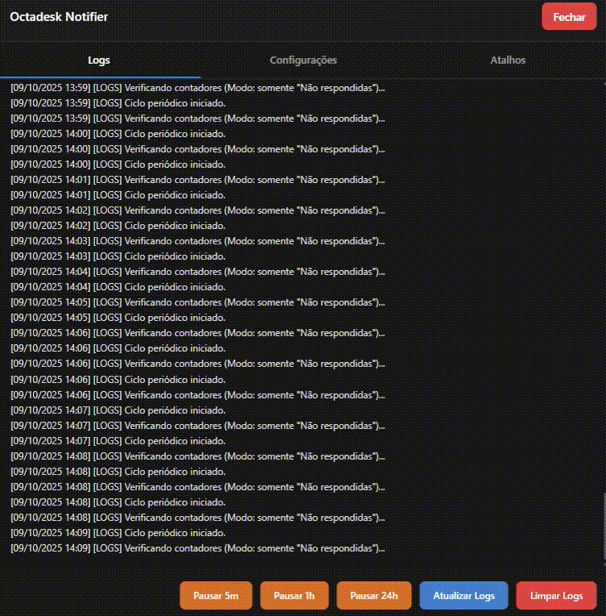

# Octadesk Notifier

**Versão:** 3.22  
**Autor:** Douglas Silva

Uma ferramenta completa de automação, monitoramento e produtividade para o Octadesk. O script notifica proativamente sobre conversas pendentes, mantém logs detalhados e inclui **atalhos de texto personalizáveis** para agilizar o atendimento. Totalmente configurável através de interface própria com design moderno e intuitivo.

---

## Visão Geral

Este UserScript para Tampermonkey foi criado para resolver múltiplos desafios no dia a dia do atendimento via Octadesk:

1. **Monitoramento Inteligente:** Detecta conversas pendentes e envia notificações automáticas
2. **Logs Detalhados:** Registra todas as ações com timestamp para auditoria e troubleshooting
3. **Atalhos de Texto:** Cria mensagens personalizadas com detecção automática do técnico em atendimento

O script conta com um **painel de controle moderno** (3 abas), **botão flutuante arrastável** e **posição persistente**, garantindo que nunca atrapalhe sua visualização.

  
  
<em>📹 Demonstração completa: Notificações, Logs, Configurações e Atalhos</em>

---

## Funcionalidades Principais

### 🔔 Sistema de Notificações

- **Notificações Persistentes e Inteligentes:** Alerta o usuário sobre conversas pendentes em intervalos regulares
- **Controle de Pausa de Notificações:**
  - Pausa temporária com opções de **5 minutos, 1 hora ou 24 horas**
  - Botão "Reativar" para retomar notificações a qualquer momento
  - Feedback visual com status "Pausado até HH:MM"
  - **Indicador visual no botão:** Ícone muda de 📊 para ⏸️ quando pausado
- **Dois Modos de Notificação:**
  1. **Modo Condicional (Padrão):** Notifica apenas se houver conversas em "Suas conversas" E em "Não respondidas"
  2. **Modo Geral:** Notifica sempre que houver qualquer conversa em "Suas conversas"
- **Intervalos Configuráveis:** Frequência de verificação ajustável: **30 segundos, 1, 3 ou 5 minutos**
- **Atualização Automática:** Clica no botão "Atualizar" antes de cada verificação

### 📊 Logs e Monitoramento

- **Histórico Detalhado:** Timestamp preciso de todas as ações (ciclos, pausas, configurações)
- **Rolagem Automática:** Logs sempre mostram as entradas mais recentes
- **Limpeza com Confirmação:** Modal personalizado para confirmar exclusão
- **Persistência:** Logs salvos no localStorage do navegador

### ⚡ Atalhos de Texto

- **Atalhos Rápidos:**
  - Digite `\dia` para inserir mensagem de bom dia
  - Digite `\tarde` para inserir mensagem de boa tarde
- **Auto-Detecção:** Captura automaticamente o nome do técnico em atendimento da conversa
- **Variáveis Disponíveis:**
  - `{saudacao}` → Substituído por "Bom dia" ou "Boa tarde"
  - `{tecnico}` → Nome do técnico detectado automaticamente
  - `{atendente}` → Seu nome configurado
- **Templates Personalizáveis:** Configure suas próprias mensagens na aba "Atalhos"
- **Preview em Tempo Real:** Visualize como a mensagem ficará antes de salvar

### 🎨 Interface Moderna

- **Painel de Controle com 3 Abas:**
  1. **Logs:** Histórico de operações + controles de pausa
  2. **Configurações:** Modo de notificação + intervalo de verificação
  3. **Atalhos:** Configuração de mensagens personalizadas
- **Botão Flutuante Arrastável:**
  - **Clique:** Abre o painel de controle
  - **Arraste:** Reposicione o botão em qualquer lugar da tela
  - **Posição Salva:** Mantém a posição escolhida após recarregar
- **Atalho de Teclado:** `Ctrl+Shift+L` abre/fecha o painel
- **Design Dark:** Interface moderna com gradientes escuros
- **Responsivo:** Adapta-se a diferentes tamanhos de tela e zoom

---

## Como Usar

### Requisitos

1. Navegador moderno (**Chrome**, **Firefox**, **Edge**)
2. Extensão **Tampermonkey** instalada

### Instalação

1. Abra o painel do **Tampermonkey** e clique em **"Criar um novo script..."**
2. Apague todo o conteúdo padrão
3. Copie o código completo do arquivo `octadesk-notifier-v3.22.user.js`
4. Cole na tela de edição do Tampermonkey
5. Salve o script (**Arquivo > Salvar** ou `Ctrl+S`)
6. Certifique-se de que está **ativado** no painel

### Configuração Inicial

#### 1. Configure as Notificações

1. Abra a página de chat do Octadesk (`https://app.octadesk.com/chat/`)
2. Pressione `Ctrl+Shift+L` ou clique no botão flutuante 📊
3. Vá para a aba **"Configurações"**
4. Escolha:
   - **Modo de Notificação** (Condicional ou Geral)
   - **Intervalo de Verificação** (30s, 1min, 3min ou 5min)
5. Clique em **"Salvar e Aplicar"**

#### 2. Configure os Atalhos (Opcional)

1. No painel, vá para a aba **"Atalhos"**
2. Preencha:
   - **Seu Nome:** Como você quer se apresentar
   - **Mensagem "\dia":** Template para bom dia
   - **Mensagem "\tarde":** Template para boa tarde
3. Use as variáveis `{saudacao}`, `{tecnico}` e `{atendente}`
4. Veja o preview em tempo real
5. Clique em **"✓ Salvar"**

### Utilização Diária

#### Notificações Automáticas

- Basta manter a aba do Octadesk aberta
- O script monitora automaticamente e notifica quando necessário
- Permita notificações no navegador quando solicitado

#### Pausar Notificações

1. Abra o painel (`Ctrl+Shift+L`)
2. Na aba "Logs", clique em:
   - **"Pausar 5m"** / **"Pausar 1h"** / **"Pausar 24h"**
3. O botão flutuante mudará para ⏸️
4. Para retomar: clique em **"▶️ Reativar"**

#### Usar Atalhos de Texto

1. Abra uma conversa no Octadesk
2. Role até ver a mensagem **"Técnico em atendimento: [Nome]"**
3. No campo de texto, digite:
   - `\dia` → Insere mensagem de bom dia
   - `\tarde` → Insere mensagem de boa tarde
4. A mensagem será inserida automaticamente com o nome do técnico

#### Posicionar o Botão

- **Clique e arraste** o botão flutuante para qualquer posição
- A posição é salva automaticamente
- Recarregue a página: o botão volta ao mesmo lugar

---

## Solução de Problemas

### Notificações não aparecem

- Verifique se o navegador tem permissão para notificar
- Desative "Não Incomodar" no sistema operacional
- Confirme que o script está ativado no Tampermonkey

### Painel não abre com Ctrl+Shift+L

- Verifique se o script está ativo no Tampermonkey
- Recarregue a página (`Ctrl+F5`)
- Abra o console (F12) e procure por erros

### Atalhos \dia e \tarde não funcionam

- Certifique-se de que a mensagem **"Técnico em atendimento: [Nome]"** está visível na conversa
- Role o chat até a mensagem aparecer na tela
- Verifique se você configurou os templates na aba "Atalhos"

### Botão flutuante está sobrepondo elementos

- **Arraste o botão** para outra posição na tela
- A nova posição será salva automaticamente

### Notificações duplicadas ou irregulares

- Recarregue a página (`Ctrl+F5`)
- Certifique-se de que não há múltiplas abas do Octadesk abertas
- O script possui proteção contra timers duplicados

---

## Tecnologias Utilizadas

- **JavaScript ES6+**
- **Tampermonkey/Greasemonkey APIs**
- **Web Notifications API**
- **LocalStorage API**
- **CSS3 (Gradients, Animations, Flexbox)**

---

## Licença

Este projeto é de uso pessoal e educacional. Sinta-se livre para modificar e adaptar às suas necessidades.

---

**🎯 Octadesk Notifier v5.3 - Nunca mais perca uma conversa importante!**
